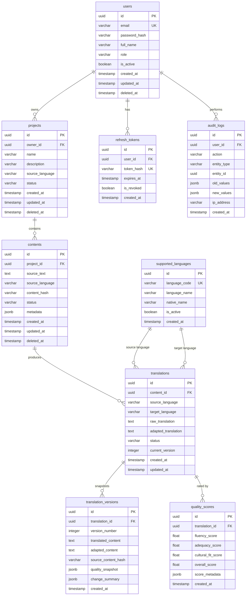

# Database Design

## AI-Powered Multilingual Content Localization Engine

---

## Table of Contents

1. [ER Diagram](#1-er-diagram)
2. [Table Definitions](#2-table-definitions)
3. [Relationships](#3-relationships)
4. [Primary Keys](#4-primary-keys)
5. [Foreign Keys](#5-foreign-keys)
6. [Constraints](#6-constraints)
7. [Indexing Strategy](#7-indexing-strategy)
8. [Audit Logging Tables](#8-audit-logging-tables)
9. [Versioning Tables](#9-versioning-tables)
10. [Future Scalability Considerations](#10-future-scalability-considerations)

---

## 1. ER Diagram

### Complete Entity Relationship Diagram



### Entity Summary

| Entity | Purpose | Estimated Row Growth |
|---|---|---|
| `users` | System user accounts | Low (hundreds) |
| `projects` | Localization project containers | Medium (thousands) |
| `contents` | Source text submitted for localization | High (tens of thousands) |
| `translations` | Translation results per content per language | High (contents × target languages) |
| `quality_scores` | Quality metrics per translation | High (1:1 with translations) |
| `translation_versions` | Immutable version snapshots | Very High (translations × revisions) |
| `supported_languages` | Language registry | Very Low (static reference) |
| `refresh_tokens` | JWT refresh token tracking | Medium (users × sessions) |
| `audit_logs` | System-wide action audit trail | Very High (append-only) |

---

## 2. Table Definitions

### 2.1 `users`

Stores all user accounts for the system. Supports both standard users and administrators.

| Column | Type | Nullable | Default | Description |
|---|---|---|---|---|
| `id` | `UUID` | NO | `gen_random_uuid()` | Primary key |
| `email` | `VARCHAR(255)` | NO | — | Unique login email |
| `password_hash` | `VARCHAR(255)` | NO | — | bcrypt-hashed password |
| `full_name` | `VARCHAR(150)` | NO | — | Display name |
| `role` | `VARCHAR(20)` | NO | `'user'` | Role: `user` or `admin` |
| `is_active` | `BOOLEAN` | NO | `TRUE` | Soft-disable flag |
| `created_at` | `TIMESTAMPTZ` | NO | `NOW()` | Account creation time |
| `updated_at` | `TIMESTAMPTZ` | NO | `NOW()` | Last profile update |
| `deleted_at` | `TIMESTAMPTZ` | YES | `NULL` | Soft-delete timestamp |

---

### 2.2 `projects`

Represents a localization project owned by a user. A project groups related content for batch localization.

| Column | Type | Nullable | Default | Description |
|---|---|---|---|---|
| `id` | `UUID` | NO | `gen_random_uuid()` | Primary key |
| `owner_id` | `UUID` | NO | — | FK → `users.id` |
| `name` | `VARCHAR(255)` | NO | — | Project display name |
| `description` | `TEXT` | YES | `NULL` | Optional project description |
| `source_language` | `VARCHAR(10)` | NO | — | Default source language code (ISO 639-1) |
| `status` | `VARCHAR(20)` | NO | `'active'` | Status: `active`, `archived`, `deleted` |
| `created_at` | `TIMESTAMPTZ` | NO | `NOW()` | Project creation time |
| `updated_at` | `TIMESTAMPTZ` | NO | `NOW()` | Last modification time |
| `deleted_at` | `TIMESTAMPTZ` | YES | `NULL` | Soft-delete timestamp |

---

### 2.3 `contents`

Stores source text content submitted for localization. Each content record belongs to exactly one project.

| Column | Type | Nullable | Default | Description |
|---|---|---|---|---|
| `id` | `UUID` | NO | `gen_random_uuid()` | Primary key |
| `project_id` | `UUID` | NO | — | FK → `projects.id` |
| `source_text` | `TEXT` | NO | — | Original text to be localized |
| `source_language` | `VARCHAR(10)` | NO | — | Detected or specified source language (ISO 639-1) |
| `content_hash` | `VARCHAR(64)` | NO | — | SHA-256 hash of `source_text` for deduplication |
| `status` | `VARCHAR(20)` | NO | `'pending'` | Status: `pending`, `processing`, `completed`, `failed` |
| `metadata` | `JSONB` | YES | `NULL` | Extensible metadata (content type, tags, notes) |
| `created_at` | `TIMESTAMPTZ` | NO | `NOW()` | Submission time |
| `updated_at` | `TIMESTAMPTZ` | NO | `NOW()` | Last status update |
| `deleted_at` | `TIMESTAMPTZ` | YES | `NULL` | Soft-delete timestamp |

---

### 2.4 `translations`

Stores the result of localizing a content record into a specific target language. One content can produce many translations (one per target language).

| Column | Type | Nullable | Default | Description |
|---|---|---|---|---|
| `id` | `UUID` | NO | `gen_random_uuid()` | Primary key |
| `content_id` | `UUID` | NO | — | FK → `contents.id` |
| `source_language` | `VARCHAR(10)` | NO | — | Source language code |
| `target_language` | `VARCHAR(10)` | NO | — | Target language code |
| `raw_translation` | `TEXT` | YES | `NULL` | Direct translation output (pre-adaptation) |
| `adapted_translation` | `TEXT` | YES | `NULL` | Culturally adapted translation (final output) |
| `status` | `VARCHAR(20)` | NO | `'pending'` | Status: `pending`, `translating`, `adapting`, `scoring`, `completed`, `failed` |
| `current_version` | `INTEGER` | NO | `1` | Latest version number |
| `created_at` | `TIMESTAMPTZ` | NO | `NOW()` | Translation initiated time |
| `updated_at` | `TIMESTAMPTZ` | NO | `NOW()` | Last update time |

---

### 2.5 `quality_scores`

Stores quality assessment metrics for each translation. Generated by the scoring engine after cultural adaptation.

| Column | Type | Nullable | Default | Description |
|---|---|---|---|---|
| `id` | `UUID` | NO | `gen_random_uuid()` | Primary key |
| `translation_id` | `UUID` | NO | — | FK → `translations.id` |
| `fluency_score` | `NUMERIC(4,3)` | NO | — | Grammatical correctness (0.000–1.000) |
| `adequacy_score` | `NUMERIC(4,3)` | NO | — | Meaning preservation (0.000–1.000) |
| `cultural_fit_score` | `NUMERIC(4,3)` | NO | — | Cultural appropriateness (0.000–1.000) |
| `overall_score` | `NUMERIC(4,3)` | NO | — | Weighted composite score (0.000–1.000) |
| `score_metadata` | `JSONB` | YES | `NULL` | Extended scoring details (weights, model version) |
| `created_at` | `TIMESTAMPTZ` | NO | `NOW()` | Scoring timestamp |

---

### 2.6 `translation_versions`

Immutable version snapshots created each time a translation is generated or re-generated. Enables version comparison and rollback.

| Column | Type | Nullable | Default | Description |
|---|---|---|---|---|
| `id` | `UUID` | NO | `gen_random_uuid()` | Primary key |
| `translation_id` | `UUID` | NO | — | FK → `translations.id` |
| `version_number` | `INTEGER` | NO | — | Auto-incremented per translation |
| `translated_content` | `TEXT` | NO | — | Snapshot of raw translated text |
| `adapted_content` | `TEXT` | YES | `NULL` | Snapshot of adapted text |
| `source_content_hash` | `VARCHAR(64)` | NO | — | Hash of source content at time of translation |
| `quality_snapshot` | `JSONB` | YES | `NULL` | Copy of quality scores at time of version creation |
| `change_summary` | `JSONB` | YES | `NULL` | Diff metadata from previous version |
| `created_at` | `TIMESTAMPTZ` | NO | `NOW()` | Version creation time |

---

### 2.7 `supported_languages`

Reference table of all languages the system can work with. Used for validation and UI language selectors.

| Column | Type | Nullable | Default | Description |
|---|---|---|---|---|
| `id` | `UUID` | NO | `gen_random_uuid()` | Primary key |
| `language_code` | `VARCHAR(10)` | NO | — | ISO 639-1 code (e.g., `en`, `ta`, `fr`) |
| `language_name` | `VARCHAR(100)` | NO | — | English name (e.g., "Tamil") |
| `native_name` | `VARCHAR(100)` | YES | `NULL` | Name in native script (e.g., "தமிழ்") |
| `is_active` | `BOOLEAN` | NO | `TRUE` | Whether language is currently available |
| `created_at` | `TIMESTAMPTZ` | NO | `NOW()` | Record creation time |

**Initial seed data:**

| Code | Name | Native Name |
|---|---|---|
| `en` | English | English |
| `ta` | Tamil | தமிழ் |
| `hi` | Hindi | हिन्दी |
| `fr` | French | Français |
| `de` | German | Deutsch |
| `es` | Spanish | Español |

---

### 2.8 `refresh_tokens`

Tracks issued refresh tokens for JWT session management. Enables token revocation and rotation.

| Column | Type | Nullable | Default | Description |
|---|---|---|---|---|
| `id` | `UUID` | NO | `gen_random_uuid()` | Primary key |
| `user_id` | `UUID` | NO | — | FK → `users.id` |
| `token_hash` | `VARCHAR(255)` | NO | — | SHA-256 hash of the refresh token (never store raw) |
| `expires_at` | `TIMESTAMPTZ` | NO | — | Token expiration time |
| `is_revoked` | `BOOLEAN` | NO | `FALSE` | Revocation flag |
| `created_at` | `TIMESTAMPTZ` | NO | `NOW()` | Token issuance time |

---

### 2.9 `audit_logs`

Append-only table recording all significant system actions for compliance and debugging.

| Column | Type | Nullable | Default | Description |
|---|---|---|---|---|
| `id` | `UUID` | NO | `gen_random_uuid()` | Primary key |
| `user_id` | `UUID` | YES | `NULL` | FK → `users.id` (NULL for system actions) |
| `action` | `VARCHAR(50)` | NO | — | Action performed (e.g., `CREATE`, `UPDATE`, `DELETE`, `LOGIN`) |
| `entity_type` | `VARCHAR(50)` | NO | — | Target entity type (e.g., `project`, `translation`, `user`) |
| `entity_id` | `UUID` | YES | `NULL` | ID of the affected entity |
| `old_values` | `JSONB` | YES | `NULL` | Previous state snapshot (for updates) |
| `new_values` | `JSONB` | YES | `NULL` | New state snapshot (for creates/updates) |
| `ip_address` | `VARCHAR(45)` | YES | `NULL` | Client IP (supports IPv6) |
| `created_at` | `TIMESTAMPTZ` | NO | `NOW()` | Action timestamp |

---

## 3. Relationships

### Relationship Map

```
users ─────────── 1:N ────────────► projects
                                      │
                                      │ 1:N
                                      ▼
                                   contents
                                      │
                                      │ 1:N
                                      ▼
                                  translations
                                   │       │
                          1:1 ◄────┘       └────► 1:N
                          ▼                        ▼
                    quality_scores         translation_versions

users ─────────── 1:N ────────────► refresh_tokens

users ─────────── 1:N ────────────► audit_logs

supported_languages ──── referenced by ──── translations (source + target)
```

### Relationship Details

| Parent Entity | Child Entity | Cardinality | Relationship Description |
|---|---|---|---|
| `users` | `projects` | One-to-Many | A user owns zero or more projects |
| `projects` | `contents` | One-to-Many | A project contains zero or more content items |
| `contents` | `translations` | One-to-Many | Each content produces one translation per target language |
| `translations` | `quality_scores` | One-to-One | Each translation has exactly one quality score record |
| `translations` | `translation_versions` | One-to-Many | Each translation accumulates version snapshots over time |
| `users` | `refresh_tokens` | One-to-Many | A user may have multiple active sessions |
| `users` | `audit_logs` | One-to-Many | A user generates many audit log entries |

### Cascade Behavior

| Parent | Child | On Delete | Rationale |
|---|---|---|---|
| `users` | `projects` | Soft delete cascade | Archiving a user archives their projects |
| `projects` | `contents` | Soft delete cascade | Archiving a project archives its content |
| `contents` | `translations` | CASCADE | Deleting content removes all translations |
| `translations` | `quality_scores` | CASCADE | Scores are meaningless without their translation |
| `translations` | `translation_versions` | RESTRICT | Versions are immutable audit records; prevent accidental loss |
| `users` | `refresh_tokens` | CASCADE | Deleting a user invalidates all sessions |
| `users` | `audit_logs` | SET NULL | Preserve audit trail even if user is removed |

---

## 4. Primary Keys

### Key Strategy

All primary keys use **UUID v4** generated by PostgreSQL's `gen_random_uuid()` function.

**Rationale:**

* **No sequential leaking** — UUIDs do not reveal entity count or creation order to external consumers.
* **Merge-safe** — No collision risk when merging data across environments (dev, staging, production).
* **Distributed generation** — Keys can be generated at the application layer or database layer without coordination.

### Primary Key Registry

| Table | Primary Key Column | Type | Generation |
|---|---|---|---|
| `users` | `id` | `UUID` | `gen_random_uuid()` |
| `projects` | `id` | `UUID` | `gen_random_uuid()` |
| `contents` | `id` | `UUID` | `gen_random_uuid()` |
| `translations` | `id` | `UUID` | `gen_random_uuid()` |
| `quality_scores` | `id` | `UUID` | `gen_random_uuid()` |
| `translation_versions` | `id` | `UUID` | `gen_random_uuid()` |
| `supported_languages` | `id` | `UUID` | `gen_random_uuid()` |
| `refresh_tokens` | `id` | `UUID` | `gen_random_uuid()` |
| `audit_logs` | `id` | `UUID` | `gen_random_uuid()` |

---

## 5. Foreign Keys

### Foreign Key Registry

| Table | Column | References | On Delete | On Update |
|---|---|---|---|---|
| `projects` | `owner_id` | `users.id` | RESTRICT | CASCADE |
| `contents` | `project_id` | `projects.id` | CASCADE | CASCADE |
| `translations` | `content_id` | `contents.id` | CASCADE | CASCADE |
| `quality_scores` | `translation_id` | `translations.id` | CASCADE | CASCADE |
| `translation_versions` | `translation_id` | `translations.id` | RESTRICT | CASCADE |
| `refresh_tokens` | `user_id` | `users.id` | CASCADE | CASCADE |
| `audit_logs` | `user_id` | `users.id` | SET NULL | CASCADE |

### Foreign Key Naming Convention

```
fk_{child_table}_{column}__{parent_table}_{column}
```

**Examples:**

```
fk_projects_owner_id__users_id
fk_contents_project_id__projects_id
fk_translations_content_id__contents_id
fk_quality_scores_translation_id__translations_id
fk_translation_versions_translation_id__translations_id
fk_refresh_tokens_user_id__users_id
fk_audit_logs_user_id__users_id
```

---

## 6. Constraints

### Unique Constraints

| Table | Column(s) | Constraint Name | Purpose |
|---|---|---|---|
| `users` | `email` | `uq_users_email` | One account per email address |
| `supported_languages` | `language_code` | `uq_supported_languages_code` | No duplicate language codes |
| `refresh_tokens` | `token_hash` | `uq_refresh_tokens_hash` | Each token hash is globally unique |
| `translations` | `content_id`, `target_language` | `uq_translations_content_language` | One translation per content per target language |
| `translation_versions` | `translation_id`, `version_number` | `uq_versions_translation_version` | No duplicate version numbers per translation |
| `quality_scores` | `translation_id` | `uq_quality_scores_translation` | One score record per translation |

### Check Constraints

| Table | Column | Constraint Name | Rule | Purpose |
|---|---|---|---|---|
| `users` | `role` | `ck_users_role` | `role IN ('user', 'admin')` | Restrict to valid roles |
| `users` | `email` | `ck_users_email_format` | `email ~* '^[^@]+@[^@]+\.[^@]+$'` | Basic email format validation |
| `projects` | `status` | `ck_projects_status` | `status IN ('active', 'archived', 'deleted')` | Restrict to valid statuses |
| `contents` | `status` | `ck_contents_status` | `status IN ('pending', 'processing', 'completed', 'failed')` | Restrict to valid statuses |
| `translations` | `status` | `ck_translations_status` | `status IN ('pending', 'translating', 'adapting', 'scoring', 'completed', 'failed')` | Restrict to valid pipeline stages |
| `quality_scores` | `fluency_score` | `ck_quality_fluency_range` | `fluency_score BETWEEN 0.000 AND 1.000` | Score must be in valid range |
| `quality_scores` | `adequacy_score` | `ck_quality_adequacy_range` | `adequacy_score BETWEEN 0.000 AND 1.000` | Score must be in valid range |
| `quality_scores` | `cultural_fit_score` | `ck_quality_cultural_range` | `cultural_fit_score BETWEEN 0.000 AND 1.000` | Score must be in valid range |
| `quality_scores` | `overall_score` | `ck_quality_overall_range` | `overall_score BETWEEN 0.000 AND 1.000` | Score must be in valid range |
| `translation_versions` | `version_number` | `ck_versions_number_positive` | `version_number > 0` | Version numbers start at 1 |
| `audit_logs` | `action` | `ck_audit_action` | `action IN ('CREATE', 'UPDATE', 'DELETE', 'LOGIN', 'LOGOUT', 'EXPORT')` | Restrict to known action types |

### Not Null Constraints

All columns marked as `Nullable: NO` in the table definitions above carry implicit `NOT NULL` constraints. Key non-obvious ones:

| Table | Column | Rationale |
|---|---|---|
| `users` | `password_hash` | Authentication requires a stored hash |
| `contents` | `source_text` | Content without text is meaningless |
| `contents` | `content_hash` | Required for deduplication logic |
| `translations` | `source_language` | Must know source for translation pipeline |
| `translations` | `target_language` | Must know target for translation pipeline |
| `translation_versions` | `translated_content` | A version without content has no purpose |

---

## 7. Indexing Strategy

### Index Design Principles

* **Index foreign keys** — Every FK column gets a B-tree index for efficient joins and cascade lookups.
* **Index filter columns** — Columns frequently used in `WHERE` clauses get dedicated indexes.
* **Composite indexes** — Multi-column indexes for common query patterns, ordered by selectivity.
* **Partial indexes** — Conditional indexes to reduce index size on sparse queries.

### Index Registry

#### `users`

| Index Name | Column(s) | Type | Notes |
|---|---|---|---|
| `pk_users` | `id` | B-tree (PK) | Automatic |
| `uq_users_email` | `email` | B-tree (Unique) | Login lookups |
| `ix_users_role` | `role` | B-tree | Admin user filtering |
| `ix_users_active` | `is_active` | B-tree (Partial) | `WHERE is_active = TRUE` |
| `ix_users_deleted` | `deleted_at` | B-tree (Partial) | `WHERE deleted_at IS NULL` (active users) |

#### `projects`

| Index Name | Column(s) | Type | Notes |
|---|---|---|---|
| `pk_projects` | `id` | B-tree (PK) | Automatic |
| `ix_projects_owner` | `owner_id` | B-tree | User's project list |
| `ix_projects_status` | `status` | B-tree | Filter by status |
| `ix_projects_owner_status` | `owner_id`, `status` | B-tree (Composite) | User's active projects |
| `ix_projects_deleted` | `deleted_at` | B-tree (Partial) | `WHERE deleted_at IS NULL` |
| `ix_projects_created` | `created_at` | B-tree | Sorting by creation date |

#### `contents`

| Index Name | Column(s) | Type | Notes |
|---|---|---|---|
| `pk_contents` | `id` | B-tree (PK) | Automatic |
| `ix_contents_project` | `project_id` | B-tree | Project's content list |
| `ix_contents_hash` | `content_hash` | B-tree | Deduplication lookups |
| `ix_contents_project_status` | `project_id`, `status` | B-tree (Composite) | Project's pending content |
| `ix_contents_deleted` | `deleted_at` | B-tree (Partial) | `WHERE deleted_at IS NULL` |

#### `translations`

| Index Name | Column(s) | Type | Notes |
|---|---|---|---|
| `pk_translations` | `id` | B-tree (PK) | Automatic |
| `ix_translations_content` | `content_id` | B-tree | Content's translations |
| `ix_translations_languages` | `source_language`, `target_language` | B-tree (Composite) | Filter by language pair |
| `ix_translations_status` | `status` | B-tree | Pipeline status monitoring |
| `ix_translations_content_target` | `content_id`, `target_language` | B-tree (Composite) | Supports unique constraint lookups |

#### `quality_scores`

| Index Name | Column(s) | Type | Notes |
|---|---|---|---|
| `pk_quality_scores` | `id` | B-tree (PK) | Automatic |
| `ix_quality_translation` | `translation_id` | B-tree (Unique) | Score lookup by translation |
| `ix_quality_overall` | `overall_score` | B-tree | Sorting/filtering by quality |

#### `translation_versions`

| Index Name | Column(s) | Type | Notes |
|---|---|---|---|
| `pk_translation_versions` | `id` | B-tree (PK) | Automatic |
| `ix_versions_translation` | `translation_id` | B-tree | Version history for a translation |
| `ix_versions_translation_number` | `translation_id`, `version_number` | B-tree (Composite) | Supports unique constraint; version ordering |
| `ix_versions_created` | `created_at` | B-tree | Chronological version browsing |

#### `refresh_tokens`

| Index Name | Column(s) | Type | Notes |
|---|---|---|---|
| `pk_refresh_tokens` | `id` | B-tree (PK) | Automatic |
| `ix_refresh_user` | `user_id` | B-tree | Revoke all sessions for a user |
| `ix_refresh_hash` | `token_hash` | B-tree (Unique) | Token validation lookup |
| `ix_refresh_expires` | `expires_at` | B-tree | Cleanup expired tokens |
| `ix_refresh_active` | `user_id`, `is_revoked` | B-tree (Partial) | `WHERE is_revoked = FALSE` |

#### `audit_logs`

| Index Name | Column(s) | Type | Notes |
|---|---|---|---|
| `pk_audit_logs` | `id` | B-tree (PK) | Automatic |
| `ix_audit_user` | `user_id` | B-tree | User activity history |
| `ix_audit_entity` | `entity_type`, `entity_id` | B-tree (Composite) | Entity change history |
| `ix_audit_action` | `action` | B-tree | Filter by action type |
| `ix_audit_created` | `created_at` | B-tree | Time-range queries |

#### `supported_languages`

| Index Name | Column(s) | Type | Notes |
|---|---|---|---|
| `pk_supported_languages` | `id` | B-tree (PK) | Automatic |
| `uq_supported_languages_code` | `language_code` | B-tree (Unique) | Language lookup by code |

---

## 8. Audit Logging Tables

### Design Philosophy

The audit system captures **who** did **what** to **which entity** and **when**, preserving both old and new state for change tracking.

### `audit_logs` Table Design

Detailed definition is in [Section 2.9](#29-audit_logs). Key design decisions:

**Append-only pattern:**

* Rows are only inserted, never updated or deleted.
* This guarantees an immutable trail of system activity.

**JSONB for state snapshots:**

* `old_values` captures the entity state before the change.
* `new_values` captures the entity state after the change.
* Using JSONB avoids the need for per-entity audit tables while remaining queryable.

### Audited Events

| Event Category | Actions Captured | Entity Types |
|---|---|---|
| **Authentication** | `LOGIN`, `LOGOUT` | `user` |
| **User Management** | `CREATE`, `UPDATE`, `DELETE` | `user` |
| **Project Lifecycle** | `CREATE`, `UPDATE`, `DELETE` | `project` |
| **Content Operations** | `CREATE`, `UPDATE`, `DELETE` | `content` |
| **Translation Events** | `CREATE`, `UPDATE` | `translation` |
| **Export Actions** | `EXPORT` | `translation`, `project` |

### Audit Log Entry Patterns

**Create operation:**

```
{
  user_id: "<actor_uuid>",
  action: "CREATE",
  entity_type: "project",
  entity_id: "<new_project_uuid>",
  old_values: null,
  new_values: { "name": "Mobile App v2", "source_language": "en" },
  ip_address: "192.168.1.10"
}
```

**Update operation:**

```
{
  user_id: "<actor_uuid>",
  action: "UPDATE",
  entity_type: "project",
  entity_id: "<project_uuid>",
  old_values: { "name": "Mobile App v1" },
  new_values: { "name": "Mobile App v2" },
  ip_address: "192.168.1.10"
}
```

**Delete operation:**

```
{
  user_id: "<actor_uuid>",
  action: "DELETE",
  entity_type: "project",
  entity_id: "<project_uuid>",
  old_values: { "name": "Mobile App v2", "status": "active" },
  new_values: null,
  ip_address: "192.168.1.10"
}
```

### Retention Policy

| Data Age | Storage | Access |
|---|---|---|
| 0–90 days | Primary `audit_logs` table | Direct query |
| 90–365 days | Partitioned archive table | Query with partition hint |
| 365+ days | Cold storage export (CSV/Parquet) | Manual retrieval |

---

## 9. Versioning Tables

### Design Philosophy

Translation versioning follows the **immutable snapshot** pattern. Each time a translation is created or re-generated, a new version record is inserted. Previous versions are never modified.

### `translation_versions` Table Design

Detailed definition is in [Section 2.6](#26-translation_versions). Key design decisions:

**Version numbering:**

* Sequential integer per translation, starting at 1.
* Enforced by unique constraint on `(translation_id, version_number)`.
* The parent `translations.current_version` always points to the latest version number.

**Content snapshots:**

* `translated_content` — Full copy of raw translation text at that point in time.
* `adapted_content` — Full copy of culturally adapted text at that point in time.
* `source_content_hash` — Hash of the source content, enabling detection of whether the source changed between versions.

**Quality snapshots:**

* `quality_snapshot` stores a full copy of quality scores at version creation time.
* This decouples version history from the live `quality_scores` table, which always reflects the latest assessment.

### Version Lifecycle

```
Content submitted for localization
  │
  ▼
Translation created (version = 1)
  ├── translation_versions record #1 inserted
  ├── quality_scores record created
  └── translations.current_version = 1

User requests re-translation
  │
  ▼
Translation updated (version = 2)
  ├── translation_versions record #2 inserted
  ├── quality_scores record updated
  ├── translations.current_version = 2
  └── Version #1 remains untouched

User compares versions
  │
  ▼
Version comparison query
  ├── Fetch version #1 and version #2
  ├── Compare translated_content fields
  ├── Compare quality_snapshot fields
  └── Return diff with change_summary
```

### Version Query Patterns

| Query | Description | Index Used |
|---|---|---|
| Get latest version | `WHERE translation_id = ? ORDER BY version_number DESC LIMIT 1` | `ix_versions_translation_number` |
| Get all versions | `WHERE translation_id = ? ORDER BY version_number ASC` | `ix_versions_translation` |
| Compare two versions | `WHERE id IN (?, ?)` | `pk_translation_versions` |
| Detect source changes | `WHERE translation_id = ? AND source_content_hash != ?` | `ix_versions_translation` |

### Data Integrity Guarantees

```
┌──────────────────────────────────────────────────┐
│              Versioning Invariants                │
├──────────────────────────────────────────────────┤
│ 1. Version numbers are strictly sequential       │
│ 2. No version record is ever updated or deleted  │
│ 3. translations.current_version always equals    │
│    MAX(translation_versions.version_number)      │
│ 4. Every completed translation has at least      │
│    one version record                            │
│ 5. source_content_hash enables change detection  │
│    across re-translation cycles                  │
└──────────────────────────────────────────────────┘
```

---

## 10. Future Scalability Considerations

### 10.1 Table Partitioning

**Candidate tables for partitioning:**

| Table | Partition Strategy | Partition Key | Trigger |
|---|---|---|---|
| `audit_logs` | Range (by month) | `created_at` | Expected high write volume; time-series access pattern |
| `translation_versions` | Range (by quarter) | `created_at` | Unbounded growth; older versions accessed less frequently |
| `translations` | List (by status) | `status` | Hot/cold separation; `completed` translations rarely updated |

**Partitioning approach:**

* Use PostgreSQL native declarative partitioning.
* Create partition tables automatically via scheduled jobs or Alembic migrations.
* Keep the most recent partitions on fast storage, archive older partitions.

### 10.2 Read Replicas

```
                  ┌─────────────────┐
                  │   Application   │
                  └────┬───────┬────┘
                       │       │
            Writes     │       │    Reads
                       ▼       ▼
              ┌────────────┐  ┌────────────┐
              │  Primary   │  │  Replica   │
              │ PostgreSQL │──│ PostgreSQL │
              │  (R/W)     │  │  (R/O)     │
              └────────────┘  └────────────┘
```

**Read-heavy queries to offload to replicas:**

* Analytics aggregation queries.
* Version history browsing.
* Audit log searching.
* Project listing with statistics.

### 10.3 Connection Pooling

| Configuration | Development | Production |
|---|---|---|
| Pool size | 5 | 20–50 |
| Max overflow | 5 | 10 |
| Pool timeout | 30s | 10s |
| Pool recycle | 1800s | 300s |
| Pre-ping | Enabled | Enabled |

Use **PgBouncer** in production for connection pooling at the infrastructure level, reducing PostgreSQL process overhead.

### 10.4 Caching Layer

```
Request → Check Cache → Cache Hit → Return cached result
                      → Cache Miss → Query DB → Store in cache → Return
```

**Cache candidates:**

| Data | TTL | Invalidation Strategy |
|---|---|---|
| Supported languages list | 1 hour | On language create/update |
| User profile | 5 minutes | On profile update |
| Project metadata | 5 minutes | On project update |
| Completed translations | 30 minutes | On re-translation |
| Analytics aggregations | 15 minutes | Time-based expiry |

### 10.5 Data Archival

| Data Type | Active Retention | Archive Strategy |
|---|---|---|
| Audit logs | 90 days in primary table | Monthly partition rotation → cold storage |
| Old translation versions | All in primary table | Quarterly archival of versions older than 1 year |
| Soft-deleted entities | 30 days for undo capability | Permanent purge after 30 days via scheduled job |
| Expired refresh tokens | 0 days (clean immediately) | Scheduled cleanup job every 24 hours |

### 10.6 Schema Evolution Guidelines

* **Always use Alembic migrations** — No manual DDL in production.
* **Backward-compatible changes only** — Add columns with defaults, never rename or remove columns in active use.
* **JSONB for extensibility** — Use `metadata` JSONB columns for optional/experimental fields before promoting to dedicated columns.
* **Feature flags for new tables** — Gate new entity types behind application-level feature flags during rollout.

### 10.7 Multi-Tenancy Readiness

The current schema supports future multi-tenancy through:

| Approach | Description | Migration Effort |
|---|---|---|
| **Row-level isolation** | Add `tenant_id` FK to `users`, `projects`, `contents`. All queries filter by tenant. | Medium |
| **Schema-per-tenant** | Each tenant gets a separate PostgreSQL schema. Application selects schema at runtime. | High |
| **Database-per-tenant** | Full database isolation. Requires connection routing layer. | Very High |

**Recommended first step:** Row-level isolation with a `tenants` table and `tenant_id` on key entity tables. PostgreSQL Row-Level Security (RLS) policies can enforce isolation at the database level.

---

## Summary

| Aspect | Decision |
|---|---|
| **Tables** | 9 tables (5 domain + 1 reference + 1 auth + 2 operational) |
| **Primary keys** | UUID v4 via `gen_random_uuid()` |
| **Relationships** | FK-enforced with appropriate cascade behavior |
| **Soft deletes** | `deleted_at` timestamp on `users`, `projects`, `contents` |
| **Versioning** | Immutable snapshot pattern in `translation_versions` |
| **Auditing** | Append-only `audit_logs` with JSONB state capture |
| **Indexing** | B-tree indexes on FKs, filters, and composite query patterns |
| **Scalability** | Partitioning, read replicas, caching, archival strategies defined |
